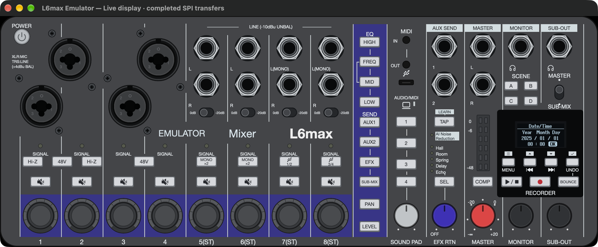

# L6max Emulator

An independently written emulator, firmware toolkit, and MIDI editor for the ZOOM
LiveTrak L6max. Run the original firmware in a native mixer UI, investigate
its hardware interfaces, and build reproducible firmware patches.



## What you can do

- Run both firmware images in a custom QEMU machine, with GPIO controls,
  firmware-rendered display output, and hardware-driven indicator LEDs.
- Use persistent flash, RTC settings, and an SD card with generated sample WAVs.
- Exercise firmware updates with a replacement installer for the unavailable
  main bootloader.
- Unpack and repack firmware packages, or build the **1.12 knob value patch**
  using the firmware's original notification renderer.
- Explore the mapped MIDI protocols or use the separate SwiftUI editor.

Audio processing and USB audio streaming are not implemented. On macOS, USB
MIDI uses CoreMIDI; SD file access uses a CLI rather than Finder mounting.
See [current model limits](docs/emulator/board.md#limitations) and
[USB coverage](docs/emulator/usb.md#current-limits).

## Quick start

For a packaged build, open the app and choose your firmware with **Select
firmware…**. **File → Open Firmware…** switches packages. See the
[macOS app guide](docs/guides/macos-app.md) for building the bundle and its
current distribution status. Tagged releases publish an Apple silicon app ZIP
and matching dependency sources through [GitHub Actions](docs/development/ci.md).

The established development environment is macOS with Xcode and its Metal
Toolchain, Rust through rustup, and QEMU build dependencies. Supply the stock
L6max 1.10 firmware yourself; **QEMU 11.1.2** is pinned as a Git submodule.
The [getting started guide](docs/getting-started.md) explains prerequisites,
setup, controls, persistent state, and troubleshooting.

Run these commands from the repository root:

```sh
git submodule update --init emulator/qemu/upstream
cargo run -p l6fw -- unpack /path/to/L6max.bin unpacked
cargo run -p qemu-build
cargo run -p l6max-gui -- emulator/qemu/build-source/build/qemu-system-arm
```

On first launch, complete Date/Time and Battery Type setup using the panel
buttons. Scroll or drag the knobs to adjust them. The visual emulator creates
and reuses a demo SD card and persistent device state in `emulator/state/`.

For a disposable headless run:

```sh
cargo run -p l6max-host -- --qemu /path/to/qemu-system-arm --volatile --seconds 10
```

## Documentation

| Start here | What it covers |
| --- | --- |
| [macOS app](docs/guides/macos-app.md) | Firmware selection and app packaging |
| [Getting started](docs/getting-started.md) | Build and run the emulator |
| [Firmware packages](docs/guides/firmware-packages.md) | Unpack, repack, supported revisions, checksums |
| [Knob value patch](docs/guides/knob-patch.md) | Build and try the 1.12 patch |
| [Firmware behavior](docs/firmware/README.md) | Chip roles, patch contracts, updates, MIDI protocols |
| [Architecture](docs/emulator/architecture.md) | Host, GUI, QEMU, and tool boundaries |
| [MIDI editor](docs/editor.md) | Build and use the SwiftUI app |
| [Contributing](CONTRIBUTING.md) | Development workflow, tests, and evidence standards |

The [documentation index](docs/README.md) links all guides and detailed
reference material, including addresses, evidence, reproduction commands,
and unresolved findings.

## Repository layout

```text
emulator/   Rust host, GPUI frontend, and custom QEMU device model
editor/     SwiftUI app and reusable MIDI protocol library
patches/    Firmware patch sources, bindings, and hook guards
tools/      Separate Rust crates for package tools and diagnostics
docs/       User guides, architecture, and firmware reference
```

## Firmware and licensing

No manufacturer firmware, product photographs, or manufacturer artwork is
bundled. Firmware packages, extracted images, storage files, and derived
analysis artifacts remain local and ignored by Git.

Original project code is [MIT licensed](LICENSE). The QEMU model is GPL-2.0-or-later;
public icon assets retain their upstream licenses. See [NOTICE.md](NOTICE.md)
for the boundaries and attribution. This project is not affiliated with ZOOM.
