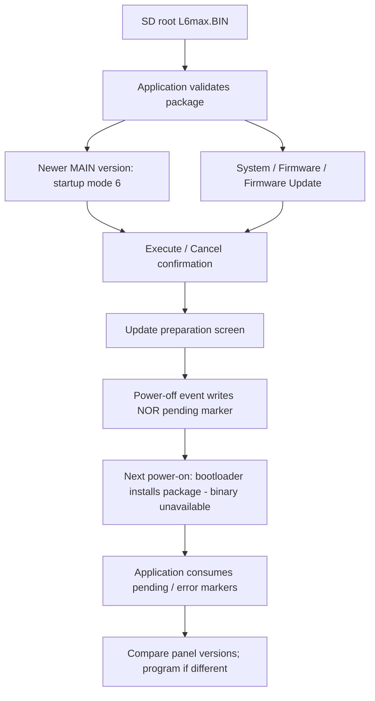

# Firmware update behavior

[Documentation index](../README.md)

Investigation pointed to two installers: a main-chip bootloader reads the SD
package into NOR, and the main application subsequently updates panel flash
through its UART ROM protocol. This map applies to the supplied main image
SHA-256 `980d92272c1f84bed200b4d2f83575202f6a00082c928d99b9e8b53af8d44461`.
Addresses are revision-specific application findings; routine names are
investigator assigned.

## Main update lifecycle



The [official update guide](https://zoomcorp.com/media/documents/L6max_Firmware_Update_Guide_EN.pdf)
describes Execute followed by a power cycle, slow Record LED blinking during
installation, fast blinking on failure, and Play/Stop held at power-on for
recovery. The application binary proves the preparation and marker mechanism;
it does not supply that bootloader or prove its recovery implementation.

`startup_select_mode` (`0x800100f0`) selects mode 6 for a validated, newer MAIN
version. This takes priority over date setup and factory mode. The manual
callback `update_menu_execute` (`0x800393b0`) calls the package validator directly,
without the newer-version comparison: this application path does not reject a
same-version or older package merely for its version. Bootloader policy remains
unknown.

Confirmation window `0x802003b4` uses action 7 for firmware update. Its initial
selection is Cancel (`1`); Up or Down selects Execute (`0`). Confirm invokes
`update_confirmation_execute` (`0x800882a8`), which revalidates the package and
enters preparation only on success. Validation therefore occurs both when
offering the update and when accepting it.

## Application checks

`update_check_file` (`0x8000a7a0`) returns:

| Code | Condition |
| --- | --- |
| 0 | Selected component checks passed |
| 1 | Board classification not enabled in package mask |
| 2 | Power state is 4, 5, or 6 |
| 3 | SD media is not ready |
| 4 | SD geometry is unsuitable (status bit 3 is set) |
| 5 | Cannot open `A:\L6max.BIN` |
| 6 | Invalid component flags, section header, read, or checksum |

The precise meanings of power states 4–6 are not yet mapped.
The guide separately documents insufficient batteries as a reason updates can
be unavailable.

`sd_mount_and_check_geometry` (`0x80076e30`) sets SD status bit 3 when the
sectors-per-cluster value does not match its capacity-dependent policy. A card
can mount and enumerate files while still failing this gate. The 128 MiB FAT16
fixture uses 16 KiB clusters (32 sectors), producing status `0x02`; the previous
64 MiB FAT32 fixture used default smaller clusters and produced `0x0a`.

`update_read_package_table` (`0x8000a908`) reads the following global header
fields. Offsets and lengths are little-endian; the flags/mask are read as bytes.

| File offset | Meaning | Supplied package |
| --- | --- | --- |
| `0x60` | Component flags: bit 0 BOOT, bit 1 MAIN | `0x02` |
| `0x64` | Bit mask indexed by hardware classification | `0x40` |
| `0x6c`, `0x70` | BOOT section offset and total length | Both zero |
| `0x78`, `0x7c` | MAIN section offset and total length | `0x100`, `0x1a8100` |

The emulated board classification is 6, matching mask `0x40`. This routine does
not compare the global `L6max System Data` label. Some table reads do not check
all returned lengths/statuses; this is not evidence of comprehensive bounds
validation.

BOOT version is read at BOOT section offset + `0x500fc`; MAIN version at MAIN
section offset + `0x1a80fc` (file `0x1a81fc` in this package). BOOT checksum is
selected only when its version differs. A flagged MAIN section is checked even
when its version matches the installed version.

### Checksum and signing

`update_check_section_checksum` (`0x800107f0`) requires an exact 256-byte section
header read and compares its prefix against `L6max Boot Data` or `L6max Main Data`.
It then reads the payload in chunks up to `0x8000` bytes, requiring successful,
complete reads, and adds every byte modulo 2^32.

```text
expected = big_endian_u32(section_header[0xfc..0x100])
actual   = sum(file[section_offset + 0x100 .. section_offset + section_length]) mod 2^32
accept when actual == expected
```

For the supplied MAIN component, the checksum word is file `0x1fc`; payload
coverage is `[0x200, 0x1a8200)`. The original computed and stored value is
`0x10863a9d`. Coverage includes main code, panel code, padding, version trailers,
and the footer. It excludes both the global header and MAIN section header.
Changing either included version marker changes the sum.

This is an integrity check, not a cryptographic signature. No signature check
was identified in these application routines. The missing bootloader could
have additional checks. The corrected knob notification package was installed on an L6max. Acceptance
of other modifications and
the bootloader's exact validation policy remain unverified.
The package tool preserves this word by default. Its explicit
`repack DIR OUTPUT --recompute-checksum` option regenerates the MAIN byte sum;
a lossless repack alone does not make an edited package pass validation.

## NOR handoff records

| Physical NOR offset | Record |
| --- | --- |
| `0x1ff000` | Eight bytes `FW UPDT\0`: pending update |
| `0x1ff008` | Twelve bytes `FW UPDT ERR\0`: update error |

The power-off event from update preparation erases the 4 KiB marker sector
and writes the pending record. Merely entering the preparation screen does
not write it. On startup,
the application consumes pending/error records and selects success or error
presentation. It trusts the handoff records rather than independently proving
that installation changed code. The application does not supply the installer
or establish how it writes the error record.

The bootloader occupies physical NOR `[0, 0x50000)` and is absent from the
supplied package. A prepared SD update successfully installed the corrected
knob patch on an L6max. The exact bootloader write sequence,
signature policy, power-loss recovery, and Record LED timing during installation
remain unverified.

## Panel update

`panel_initialize_and_update` (`0x8004ca38`) runs during main application startup.
It compares the four packaged bytes at NOR `0x1f6ffc` with panel flash
`0x08003ffc`. Equal versions skip programming even if code bytes differ.
Validity here only requires the high bit of each version byte to be clear;
it is not an ASCII-digit check.

1. Configure UART at 115200 with the ROM-mode framing; drive BOOT high through
   GPIO1.29 and pulse reset through GPIO5.1. Send `0x7f` and expect ACK `0x79`.
2. Read installed version and, when an update is needed, read option bytes at
   `0x1fff7800`. Clear bit 0 of option byte 3 when set, write them back, and
   reenter ROM mode. Its hardware meaning is not assigned here.
3. Erase the last 2 KiB page at `0x08003800`, then the complete 16 KiB region.
4. Program 64 blocks of 256 bytes from NOR `[0x1f3000, 0x1f7000)` into panel
   `[0x08000000, 0x08004000)`. Insert the packaged version at `0x08003ffc`.
5. Read back all 64 blocks and compare against the same source and injected
   version. Any difference fails initialization.
6. Lower BOOT, reset the panel into its application, restore normal UART mode,
   request RTC/key state, and send startup configuration.

The executable panel file is only `0x3ad8` bytes; the programming region includes
its padding and version stamp. The QEMU model implements this ROM exchange;
it does not use SD update installation to provide the main bootloader.

| Panel ROM command | Framing |
| --- | --- |
| `7f` | Synchronization; ACK `79` |
| `44 bb` | Extended erase; 2 KiB page indices |
| `11 ee` | Big-endian address + XOR; count minus one + complement |
| `31 ce` | Big-endian address + XOR; count minus one, data, XOR |

Transfers use blocks no larger than 256 bytes and waits generally bounded at
2 seconds. NACK is `0x1f`; some intermediate paths reject NACK rather than
requiring an exact ACK. Read/write helpers permit panel flash addresses and the
option-byte address; their start-address checks are not a general host memory
access service.

## Emulator diagnostic

`firmware-update-smoke` starts with the original firmware and package and creates
fresh 128 MiB FAT16 SD and device state fixtures with 16 KiB clusters. It changes
MAIN version markers to `0111`, panel version to `0101`, and reserved vector
slots to distinguish the installed images without changing executable code.
One fixture retains the old checksum; another recomputes it. All fixture state
is removed after execution, including failure, and user state/SD arguments are
rejected.

The diagnostic confirms the corrupt package does not trigger an update, the
valid package selects startup mode 6, Execute completes preparation, and a
3500 ms guest-clock Power hold writes the marker. The replacement installer
copies the complete MAIN payload on restart. Actual main firmware selects
success mode 4, consumes the marker, programs 64 panel blocks, and verifies the
new panel image. NOR boot/calibration/settings bytes are checked unchanged.
A further launch without the SD card confirms both installed images persist
and the panel is not programmed again.

### Verification limits

- The original package checksum was independently calculated and matches
  `0x10863a9d`.
- SD-to-NOR installation is performed by the explicit Rust model. Its
  successful execution does not prove how the missing hardware bootloader
  behaves. Hardware installation separately succeeded for the corrected
  knob package; arbitrary package acceptance remains unknown.
- Installer error-record behavior is covered by unit tests; the diagnostic
  exercises the successful firmware handoff, not a physical interrupted update.

```sh
# Run from the repository root.
cargo run --offline -p firmware-update-smoke -- \
  --qemu /private/tmp/l6-qemu-src/build/qemu-system-arm \
  --volatile --logs emulator/logs/firmware-update-smoke
```

## Manufacturer bootloader comparison

There are three distinct layers to consider:

| Layer | Finding | Confidence |
| --- | --- | --- |
| Panel system ROM | Matches ST's STM32 USART bootloader: BOOT/reset entry, even-parity `7f`, ACK `79`, NACK `1f`, commands `11`, `31`, `44`, address/data XOR | Strong protocol match; exact STM32 part/ROM revision unproved |
| Main chip system ROM | i.MX RT-family ROM boot/download facilities are plausible given the peripheral map | Family inference; no ROM image or boot configuration supplied |
| Main SD installer in NOR | ZOOM package labels, board mask, version locations and `FW UPDT` records require device-specific handling | Custom installer behavior inferred; underlying SDK/source ancestry unknown |

ST documents the observed panel synchronization, command/complement framing,
read/write protocol and extended erase in
[AN3155](https://www.st.com/resource/en/application_note/an3155-how-to-use-usart-protocol-in-bootloader-on-stm32-mcus-stmicroelectronics.pdf).
This is substantially stronger evidence than identifying a bootloader from
strings. The existing panel ROM model already implements that protocol subset.

NXP distinguishes its fixed i.MX RT BootROM, which boots flash and supports
UART/USB-HID SDP downloads into RAM, from its downloadable MCU Bootloader
Flashloader, used for flash programming during manufacturing. See the
[MCUXpresso manufacturing overview](https://mcuxpresso.nxp.com/mcuxsdk/25.09.00/html/middleware/mcu_bootloader/docs/iMXRT1050_Manufacturing_User_Guide/topics/overview.html).
Those facilities alone do not implement the observed ZOOM SD filename and
update-marker contract.

NXP also provides a customizable second-bootloader example in
[AN12604](https://www.nxp.com/docs/en/application-note/AN12604.pdf), using flash
operations and UART/USB commands. ZOOM could reuse those drivers or libraries,
but the missing NOR boot region prevents a binary comparison. The ZOOM package
format is not evidence that its installer is the stock NXP Flashloader, nor
does the existence of a manufacturer ROM downloader prove its accessibility or
security configuration on a physical L6max. No exact main MCU part, standard
main bootloader implementation, or bootloader signature policy is assigned.

The application serial close path waits at `0x800325b8` for LPUART `STAT.TC`,
then clears status and disables the controller. This matches the behavior of
NXP's SDK [`LPUART_Deinit`](https://github.com/nxp-mcuxpresso/mcux-sdk/blob/main/drivers/lpuart/fsl_lpuart.c).
A local GDB trace found preparation blocked there with base `0x4018c000`
(LPUART3, DIN MIDI). Modeling its idle transmit-complete state lets the
application finish preparation. This supports SDK-driver reuse in the main
application; it does not identify the source of the absent bootloader.

## Replacement installer model

The native engine's `--update-bootloader` option runs
[`update_bootloader.rs`](../../emulator/host/src/update_bootloader.rs) before
launching QEMU. QEMU continues to load main execution from persistent NOR and
panel execution from persistent panel flash. The Rust model fills the missing
SD-to-NOR step; it is not an implementation of NXP ROM code or recovered ZOOM
bootloader code.

The model acts only when `main-nor.bin` contains `FW UPDT\0`. It exclusively locks
that existing file, refuses storage held by a live guest, reads the SD image
without modifying it, and validates the observed MAIN-only section. It copies
payload `[0x200, 0x1a8200)` into NOR `[0x50000, 0x1f8000)`, including packaged
panel data and the installed-version footer. It preserves bootloader bytes,
calibration, settings and the pending record. On validation/media failure it
leaves the installed payload intact and writes the error record for application
startup to consume. An existing error record is passed to the application
without automatically retrying installation.

SD input supports an unpartitioned FAT volume or the first FAT partition in an
MBR. The model additionally enforces the known total length, section location,
MAIN-only flags and consistent trailers. These are explicit model restrictions,
not claims about extra checks in ZOOM's bootloader.

```sh
# Run from the repository root.
cargo run -p l6max-gui -- /path/to/qemu-system-arm \
  --state-dir emulator/state/update-device --sd-image /path/to/card.img \
  --update-bootloader
```

Select Execute in the firmware UI, hold Power to perform power-off, and click
Power after the display goes blank to start again. Alternatively, close the
emulator after power-off and relaunch with the same arguments. Closing the UI alone is not a firmware
power-off request. The flag requires persistent state. The normal persistent
visual UI enables it automatically when a card is attached; headless tools
require the explicit flag.

### Model limitations

- BOOT-component replacement is unsupported because its installer is missing.
- Boot-ROM execution, signatures/security configuration, installation LED timing,
  and interrupted/power-loss writes are not modeled.
- Installation uses a bounded host operation before guest execution, rather than
  guest instructions or simulated sector erase/program timing.
- Storage files represent nonvolatile hardware; input/display IPC still uses
  anonymous memory and inherited sockets.

Unit tests cover corruption/layout rejection, no-marker behavior, full payload
installation, unchanged boot/calibration/settings bytes, read-only SD access,
error records and live-storage locking. Explicit checksum regeneration of an
unmodified package produces the original SHA-256 byte-for-byte.
