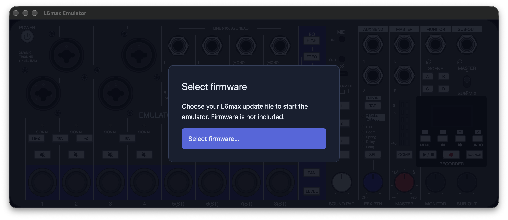

# macOS application bundle

[Documentation index](../README.md)

The bundle contains the native frontend, the custom QEMU binary, and its
non-system dynamic libraries. Testers do not need Rust, Xcode, Homebrew, or a
source checkout. They supply their own firmware.

## Use the app



1. Unzip the app and place **L6max Emulator.app** in Applications or another folder.
2. Open it. A fresh installation shows **Select firmware** over the panel.
3. Click **Select firmware…** and choose a supported `L6max.bin` update package.
   The app validates its layout and checksum, extracts it into local storage,
   creates its demo SD card, and starts the firmware.
4. Complete Date/Time and Battery Type setup with Up, Down, and Confirm.

Use **File → Open Firmware…** or **⌘O** to choose another package and restart
the guest. Cancelling the picker or choosing an invalid package keeps the
running guest. The app remembers a successfully started selection for the
next launch; the original selected file can then be moved or deleted.

The supported package layout and revision scope are described in
[firmware packages](firmware-packages.md). The application validates integrity,
not manufacturer authenticity.

## Use a folder as the SD card

Choose **File → Use SD Card Folder…** (**⇧⌘O**) after selecting firmware.
Select a folder containing the files and subdirectories you want on the card.
The app imports it in the background, then restarts the guest with that card.
Flash and RTC state are retained. The selected card is remembered per firmware.

The folder is copied into a private FAT card; it is not a live shared folder.
Guest writes persist in that copy and never sync back into the original folder.
Choose the folder again to import newer host contents into another card copy.
Previously imported cards are retained in Application Support.

- Capacity is chosen automatically from 128 to 512 MiB, with 16 KiB clusters.
- Nested directories and long Unicode filenames are preserved within FAT limits.
- Symbolic links, special files, invalid FAT names, and case-insensitive filename
  collisions are rejected before changing the running guest.
- Audio playback remains unmodeled; the card still exercises firmware browsing,
  assignment, and update-file checks.

## Local storage

Bundled mode writes to `~/Library/Application Support/L6max Emulator/`:

| Path | Contents |
| --- | --- |
| `firmware/<package-sha256>/` | Imported package and extracted components |
| `devices/<package-sha256>/` | Persistent flash, RTC, and demo SD card |
| `logs/<package-sha256>/` | QEMU trace and diagnostic output |
| `cards/card-*.img` | Persistent copies imported from selected directories |
| `devices/<package-sha256>/sd-card-selection.txt` | Remembered imported card selection |
| `selected-firmware.txt` | Identity of the last successfully started package |

Each package has separate device storage so selecting another firmware starts
that image instead of reusing a different image already installed in NOR.
Returning to the same package reuses its state. The app bundle itself stays
read-only. `L6_APP_DATA` overrides the writable directory for development tests.

## Build a bundle

Build the custom QEMU binary first using [getting started](../getting-started.md).
From the repository root on macOS:

```sh
cargo run -p macos-package -- emulator/qemu/build-source/build/qemu-system-arm
```

The tool builds the release GUI and creates:

```text
emulator/dist/L6max Emulator.app
emulator/dist/L6max-Emulator-macos.zip
```

Use `--debug` for a faster local build, or `--output DIR` for another destination.
`--version v0.1.0` sets the app version; it defaults to the Cargo package version.
Existing app/ZIP outputs are rejected; use a new output directory for another build.
The bundle targets the build machine's architecture, not a universal GUI binary.

The packager verifies that QEMU contains `l6max-dual`, copies native dependencies
recursively, rewrites their loader paths, includes the original app icon and
license notices, and applies/verifies an ad-hoc signature before creating the ZIP.
It never copies firmware or device state. Native and Rust dependency inventories
are included in Resources, along with the custom QEMU model sources.

## Automated releases

The [CI and release workflow](../development/ci.md) builds the pinned QEMU
submodule and publishes an optimized Apple silicon app when a version tag is
pushed. Each release includes checksums and matching QEMU, Rust, and bundled
native dependency sources. CI also provides a debug ZIP as a workflow artifact.

## Distribution status

- The currently validated preview is Apple silicon and requires macOS 27,
  reflecting the bundled native libraries’ deployment targets. Supporting an
  earlier macOS release requires compatible QEMU and native dependency builds.

- Bundles have ad-hoc signatures and are not Developer ID signed or notarized.
  Downloaded builds may be blocked by Gatekeeper. Tagged release notes explain
  this; signing and notarization are not configured in CI.
- The minimum OS entry is derived from bundled Mach-O deployment targets,
  with a macOS 13 floor. Compatibility on older OS versions than the development
  machine has not been verified.
- Tagged releases provide companion source archives for their exact builds.
  Locally built app bundles include model sources and notices but do not
  automatically collect the full source archive.
- CoreMIDI support exists in the engine, but the bundle currently has no UI
  toggle for USB services; CLI arguments still select them.

## Validation

The opt-in bundle diagnostic runs without the host mouse. Use absolute firmware
paths and a fresh writable data directory:

```sh
L6_APP_DATA=/tmp/l6-bundle-test \
L6_BUNDLE_SMOKE_FIRST=/path/to/stock/L6max.bin \
L6_BUNDLE_SMOKE_SECOND=/path/to/patched/L6max.bin \
L6_BUNDLE_SMOKE_SD_FOLDER=/path/to/sd-folder \
  "emulator/dist/L6max Emulator.app/Contents/MacOS/l6max-gui"
```

It imports the first package, waits for actual firmware display output, compares
persisted NOR with the selected image, verifies restored selection, rejects an
invalid package without disturbing the guest, and restarts into the second
package's isolated state. With `L6_BUNDLE_SMOKE_SD_FOLDER`, it also imports a
folder, restarts the guest, verifies actual SD read commands and restored card
selection. Native file-picker presentation should also be checked
interactively; the diagnostic supplies paths directly to the import/restart code.

To check the actual native pickers without moving the host mouse:

```sh
L6_APP_DATA=/tmp/l6-menu-test \
L6_MENU_SMOKE_FIRMWARE=/path/to/stock/L6max.bin \
  "emulator/dist/L6max Emulator.app/Contents/MacOS/l6max-gui"
```

This dispatches the File menu actions through GPUI, checks the native file and
directory pickers, and cancels them through AppKit. It checks Open Firmware
before and after loading a guest, repeated invocation after cancellation, and
that cancellation keeps the guest running. Use a fresh data directory.
